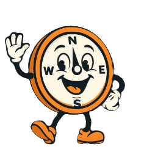

# Energiekompas

Energie Kompas is een project dat mensen met Multiple Sclerose (MS) helpt om beter om te gaan met hun energie. Het doel is om via een app te laten zien hoeveel energie iemand heeft en wat dat beïnvloedt.
Mensen met MS weten vaak niet goed hoeveel energie ze op een dag hebben omdat dit sterk kan schommelen. De app verzamelt gegevens zoals hartslag, slaap en beweging en koppelt die aan hoe de gebruiker zich voelt. Op dit moment laat de app vooral cijfers zien. De opdracht is om nieuwe technologie (zoals kunstmatige intelligentie en wearables) toe te voegen, zodat de app beter kan leren en voorspellen hoe het energieniveau verandert.

Features

- Homepagina samenvattend dashboard
  - Het volgende verwacht herstelmoment, gebaseerd op eerdere activiteiten en trends in energieverloop.
  - De volgende impactvolle activiteit, zodat de gebruiker zich mentaal kan voorbereiden.
  - Een checklist met kleine, concrete acties, gericht op rust, overzicht en structuur.
- Grafiekpagina energiegrafiek & activiteiten
  - Via Google Agenda, waarin geplande activiteiten automatisch worden opgehaald.
- AI Chatbot persoonlijke assistent
  - Het stellen van vragen over MS, energie en herstel.
  - Het adviseren voor het toevoegen van een activiteit. 
  - Ondersteuning bij het interpreteren van inzichten en grafieken.
- Kernstatistieken Health Connect
  - Slaapduur.
  - Gemiddelde hartslag.
  - Basis bewegingsdata.

Tech stack

- Android (Kotlin, XML).
- Android Jetpack (Compose, ViewModel, Navigation).
- Health Connect API voor gezondheidsdata (zie ontwerpdocument stepping stone 5: Energie Kompas Logica).
- Google Gemini API voor het aanpassen van de Kompi chatbot (zie stepping stone 4 voor meer informatie).
- Room Database voor lokale opslag (zie stepping stone 4 voor meer informatie).
- Gradle voor dependency management.
- Minimum SDK: API 26 (Android 8.0).

Oplossing

Energie Kompas is een Android-app die energie-inzicht combineert met data en AI-ondersteuning. De applicatie is ontworpen om gebruikers met MS te helpen om grip te krijgen op hun dag, zonder dat zij zelf complexe analyses hoeven te maken.
