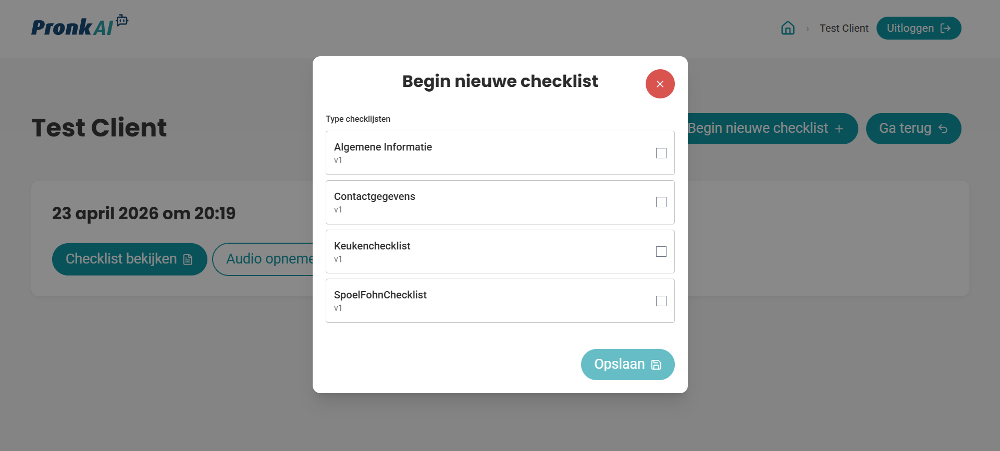
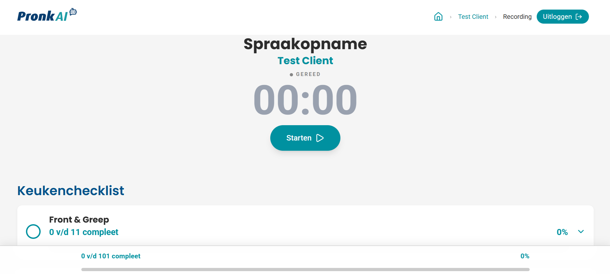

# Smart Kitchen 2.0

Smart Kitchen 2.0 is ontwikkeld voor Pronk Ergo Woon+ om het adviesproces voor ergonomische keukens te digitaliseren.  
Tijdens klantgesprekken wordt informatie nu vaak handmatig en onvolledig vastgelegd. Dit project levert een werkende basis waarmee adviseurs klantwensen, afmetingen en beperkingen sneller en consistenter kunnen registreren.

## Projectdoel

Het doel van dit project is om:

- de papieren checklist te vervangen door een digitale workflow;
- klantinformatie tijdens gesprekken direct gestructureerd vast te leggen;
- de overdracht naar calculatie en ontwerp te versnellen.

## Wat is opgeleverd

De huidige versie bevat de kernfunctionaliteiten van het proces:

- klantenoverzicht met checklists per klant;
- audio-opname tijdens het gesprek;
- AI-ondersteuning die gesproken input omzet naar checklist-antwoorden;
- checklistbeheer met voortgang, aanpassingen en export naar Excel;
- upload van beelden die gekoppeld zijn aan de juiste checklist.

## Technische basis

De oplossing draait als modulaire Docker-stack met een frontend, API, PostgreSQL/PostGIS en MinIO-opslag.  
Checklistdata wordt gestructureerd opgeslagen in de database, terwijl uploads en media in object storage terechtkomen.

## Vervolg

Voor verdere doorontwikkeling liggen de belangrijkste stappen bij:

- toevoegen van verschillende checklisttypen;
- verbeteren van foutafhandeling en gebruikersfeedback;
- uitbreiden met extra rollen en beheerfunctionaliteit;
- verdere productie-inrichting, monitoring en back-upstrategie.
