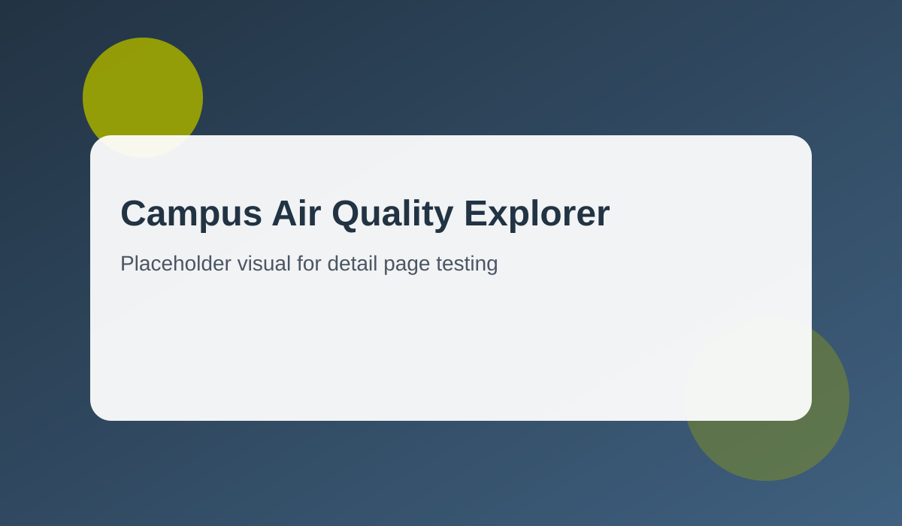
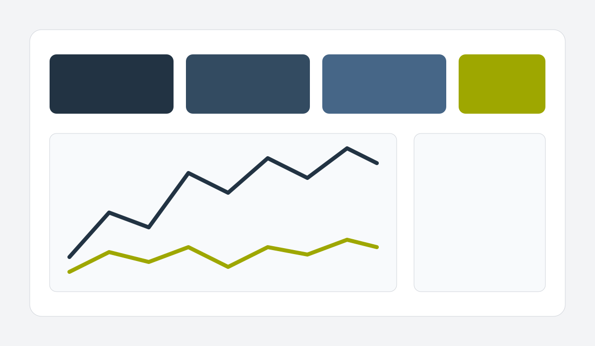
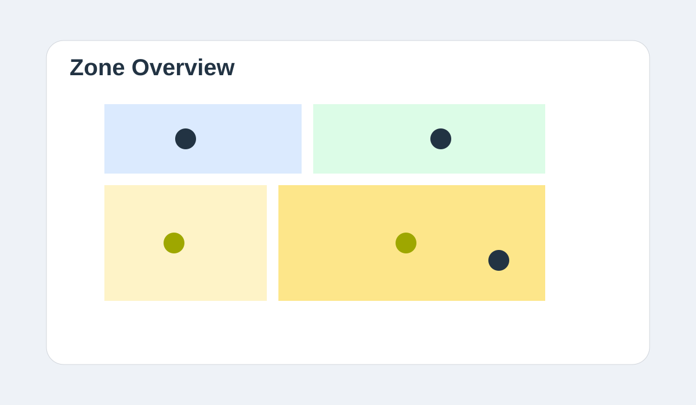

# Campus Air Quality Explorer

Dit project onderzoekt hoe studenten en medewerkers de luchtkwaliteit op en rond de campus ervaren.  
Het team heeft een concept ontwikkeld waarin live sensorwaarden, locatie-informatie en eenvoudige trends samenkomen in een dashboard dat begrijpelijk blijft voor niet-technische gebruikers.

## Projectdoel

Het doel is om een praktisch hulpmiddel te bouwen dat:

- inzicht geeft in verschillen tussen binnen- en buitenmetingen;
- piekmomenten in CO2, fijnstof en temperatuur laat zien;
- met eenvoudige aanbevelingen helpt om ruimtes gezonder te gebruiken.

## Aanpak

In de eerste sprint is een datamodel opgezet met meetpunten per gebouwzone.  
Daarna is een interactief prototype gemaakt met filters op tijd, locatie en type meting.  
In de laatste fase is extra aandacht besteed aan toegankelijkheid, duidelijke labels en mobiele leesbaarheid.

## Eerste resultaten

De eerste tests met voorbeelddata laten zien dat pieken tijdens drukke lesblokken snel zichtbaar worden.  
Gebruikers konden vooral de combinatie van een kaartweergave met tijdlijn goed interpreteren.  
Feedback van stakeholders was dat samenvattende teksten onder grafieken veel helpen bij besluitvorming.

## Volgende stap

Voor een volgende iteratie wil het team:

- sensordata dichter bij realtime ophalen;
- notificaties toevoegen bij grenswaarden;
- maandelijkse vergelijkingen tonen per gebouw;
- een export voor rapportage aan facilitair management toevoegen.

